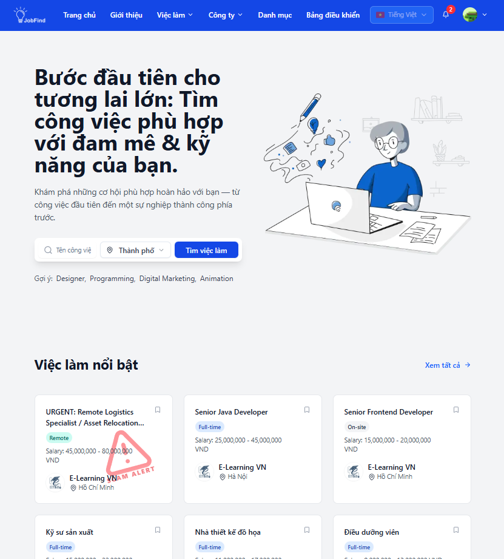

# Smart Job Finder Client (Next.js)

The user-facing web application for the Smart Job Finder system, built with **Next.js App Router**. It supports job searching, profile management, recruiter dashboards, real-time notifications, and AI-powered features (Job recommendations, CV matching, Interview Coach).

## 📦 Tech stack

- **Framework:** Next.js 15 (App Router) + React 19
- **Styling:** Tailwind CSS 4, Radix UI, shadcn components
- **State Management:** Redux Toolkit + RTK Query, Zustand
- **Network:** Axios, WebSocket (STOMP), Jitsi SDK
- **Localization:** i18n with `ttag`

## 📸 Screenshots


_Smart Job Finder Homepage - Find jobs that match your passion & skills_

## 🚀 Quick Start

```bash
https://github.com/SmartJobFinder/smart-job-finder-client
cd job-find-user-app
npm install

# Run development server
npm run dev   # http://localhost:3000
```

### Environment Variables (`.env.local`)

Create a `.env.local` file with the following variables:

```bash
NEXT_PUBLIC_API_PROXY_TARGET=http://localhost:8082   # Backend URL for development proxy
NEXT_PUBLIC_API_BASE_URL=/api/v1                     # API prefix
NEXT_PUBLIC_WS_ENDPOINT=/ws                          # WebSocket endpoint
NEXT_PUBLIC_SUB_DEST=/user/queue/noti                # Notification subscription destination
```

### Scripts

- `npm run dev`: Run development server
- `npm run build`: Build for production
- `npm start`: Run production build
- `npm run lint`: Run ESLint

## 🐳 Docker Deployment

### Prerequisites

- Docker 20.10+
- Docker Compose 2.0+

### Quick Start

1.  **Create .env from template**:

    ```bash
    cp .env.example .env
    # Edit .env with your configuration
    ```

2.  **Build and run with Docker Compose**:

    ```bash
    docker-compose -f docker-compose.dev.yml up -d
    ```

3.  **Access the application**: http://localhost:3000

### Build Docker Image

```bash
docker build \
  --build-arg NEXT_PUBLIC_API_BASE_URL=/api/v1 \
  --build-arg NEXT_PUBLIC_WS_ENDPOINT=/ws \
  --build-arg NEXT_PUBLIC_SUB_DEST=/user/queue/noti \
  --build-arg NEXT_PUBLIC_GOOGLE_CLIENT_ID=your-client-id \
  -t smart-job-finder-client:latest .
```

### Run Container

```bash
docker run -d \
  -p 3000:3000 \
  -e NEXT_PUBLIC_API_BASE_URL=/api/v1 \
  -e NEXT_PUBLIC_WS_ENDPOINT=/ws \
  -e NEXT_PUBLIC_SUB_DEST=/user/queue/noti \
  -e NEXT_PUBLIC_GOOGLE_CLIENT_ID=your-client-id \
  --name smart-job-finder-client \
  smart-job-finder-client:latest
```

## 🗂️ Project Structure

```
src/
  app/          # Next.js App Router pages & layouts
  components/   # Reusable UI components
  features/     # Redux slices/features (Auth, Jobs, etc.)
  services/     # RTK Query & Axios service definitions
  store/        # Redux store configuration
  hooks/, lib/, utils/, constants/, validation/
public/         # Static assets & i18n JSON files
```

## 🔑 Key Features

- **Job Search:** Advanced filtering, view details, apply with one click, save jobs.
- **User Profile:** Manage personal info, CV templates, CV matching scores.
- **Companies:** View company profiles, follow companies.
- **Recruiter Dashboard:** Post/Manage jobs, manage candidates, analytics.
- **Interviews:** Schedule tracking, video interviews (Jitsi), AI Interview Coach.
- **Notifications:** Real-time updates via WebSocket + Toast notifications.

## 🔐 Security & Access Control

- **Auth:** JWT stored in HTTP-only cookies, auto-refresh on 401 errors.
- **Middleware:** Route protection for authenticated users and recruiters.
- **Proxy:** Dev proxy rewrites `/api` and `/ws` requests to the backend.

## 👥 Team

- **[Võ Nhật Hào](https://github.com/nhathao512)**
- **[Pham Văn Phúc](https://github.com/pkucpkam)**
